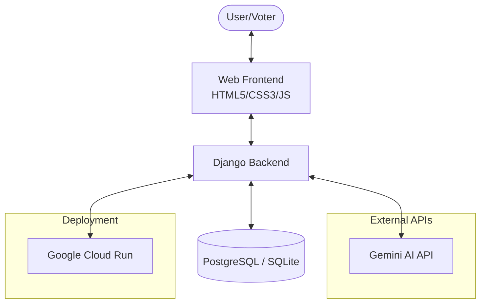
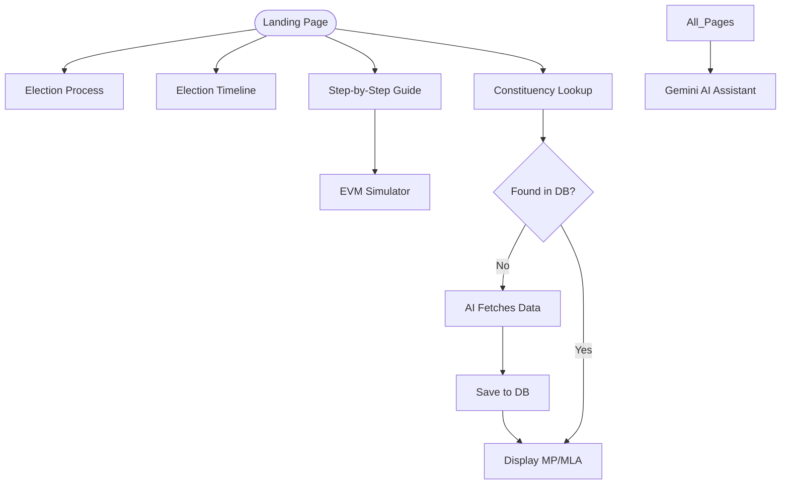
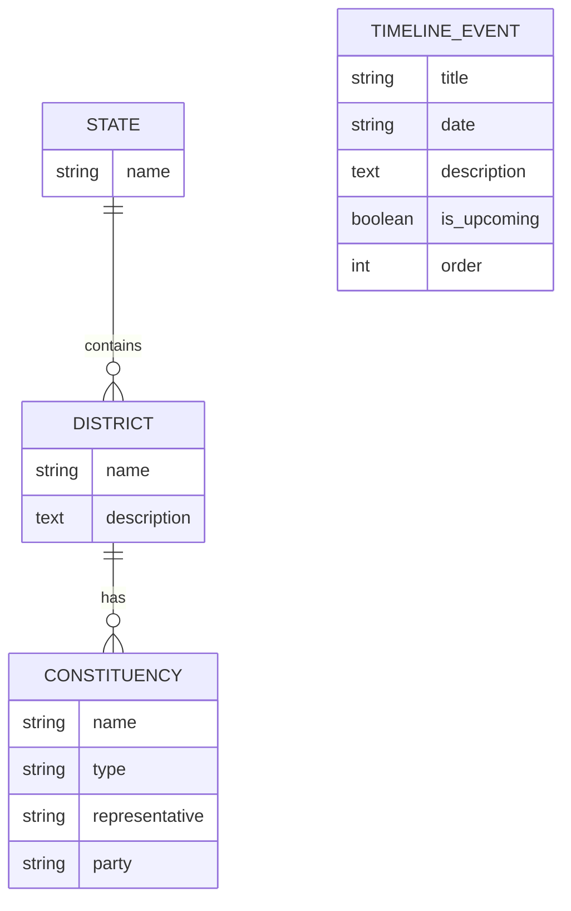

# Election Buddy 🗳️

**Election Buddy** is a modern, responsive, and AI-powered web platform designed to educate citizens about the election process in India. It simplifies complex democratic procedures using interactive tools, AI-driven insights, and a premium glassmorphism user interface.

🚀 **Live Demo:** [https://election-buddy-362800866431.asia-south1.run.app](https://election-buddy-362800866431.asia-south1.run.app)

---

## 🏛️ Project Context

### 🎯 Chosen Vertical
**Civic Education & Democratic Engagement.**  
Election Buddy targets the information gap in the democratic process, specifically aiming to empower first-time voters and citizens with limited technical knowledge by making election data accessible and engaging.

### 🧠 Approach and Logic
- **User-Centric Design**: Utilizing a "Glassmorphism" aesthetic to create a modern, non-intimidating interface that feels like a premium consumer app rather than a dry government portal.
- **Hybrid Data Strategy**: A "Database-First, AI-Fallback" logic. The system first checks a verified local database for constituency and representative data. If unavailable, it dynamically queries the **Gemini AI API** to provide real-time information, which is then cached for future users.
- **Simulated Learning**: Instead of just reading text, users *learn by doing* through the interactive EVM simulator, which reduces anxiety about the actual voting day.

### ⚙️ How the Solution Works
1. **Entry**: The user arrives at the dashboard and is presented with high-level navigation: Process, Timeline, Steps, or Lookup.
2. **Interaction**:
   - **Static Content**: Pages like "The Process" serve structured educational content.
   - **Dynamic AI Content**: The "Timeline" and "Constituency Lookup" trigger backend logic that interfaces with Google Gemini to fetch and structure data into JSON for the frontend.
   - **Stateful Simulator**: The EVM simulator uses client-side JavaScript to maintain the state of the "ballot" and "VVPAT" units without requiring a server refresh.
3. **Assistance**: The Gemini AI Chatbot is globally available, using a custom system prompt to remain in "Election Assistant" mode across all pages.

### 📝 Assumptions Made
- **Connectivity**: A stable internet connection is assumed for real-time AI lookups and chatbot functionality.
- **Data Accuracy**: AI-generated representative data is assumed to be the most current available to the model, though users are advised to verify with official sources.
- **Environment**: The solution assumes a containerized environment (Docker) for consistent deployment across local and cloud (Cloud Run) environments.
- **Browser Support**: Assumes a modern browser capable of rendering CSS variables and Flexbox/Grid for the responsive UI.

---


---

## 🌟 Key Features

### 1. ⚙️ The Election Engine (Process)
A visual journey through the core stages of an election:
- **Nominations**: How candidates step forward.
- **Campaigns**: Understanding party promises.
- **Voting**: The mechanics of the polling booth.
- **Counting & Results**: How every voice is tallied.

### 2. 🎮 Interactive EVM Simulator
A first-of-its-kind virtual voting experience:
- **Ballot Unit**: Realistic candidate list with buttons and LEDs.
- **VVPAT Unit**: Visual confirmation slip generation.
- **Beep System**: Authentic sound-like feedback for successful voting.

### 3. 📍 AI-Powered Constituency Lookup
Find your representatives instantly:
- Search by **State** and **District**.
- Get real-time data on current **MPs** and **MLAs**.
- Powered by **Gemini AI** for districts with missing records.

### 4. ⏳ Live Election Timeline
Stay updated with the latest democratic milestones:
- Dynamic timeline generated via AI.
- Includes phases like Announcement, Filing, Polling, and Results.

### 5. 📜 Party Manifestos
Direct access to the official platforms of major political parties (BJP, INC, AAP, CPI(M)), helping voters make informed choices.

### 6. 🤖 Gemini AI Guide Assistant
An interactive chatbot available on every page to answer any election-related questions in simple, non-technical language.

---

## 📊 System Architecture

The system is built using a modern decoupled architecture ensuring scalability and intelligence.



---

## 🗺️ Project Flow Chart

How users navigate through the Election Buddy experience.



---

## 🗄️ Database System

The application uses a relational schema to manage geographical and election data efficiently.



---

## 🛠️ Tech Stack

- **Backend**: Django (Python)
- **Frontend**: Vanilla HTML5, CSS3 (Glassmorphism), JavaScript
- **AI Engine**: Google Gemini Pro (Generative AI)
- **Database**: PostgreSQL (Production), SQLite (Development)
- **Static Files**: WhiteNoise
- **Deployment**: Google Cloud Run & Docker

---

## 🚀 Installation & Setup

1. **Clone the repository**:
   ```bash
   git clone https://github.com/yourusername/election-buddy.git
   cd election-buddy
   ```

2. **Install dependencies**:
   ```bash
   pip install -r requirements.txt
   ```

3. **Set up environment variables**:
   Create a `.env` file in the root:
   ```env
   SECRET_KEY=your_secret_key
   GEMINI_API_KEY=your_gemini_api_key
   ```

4. **Run migrations**:
   ```bash
   python manage.py migrate
   ```

5. **Start the server**:
   ```bash
   python manage.py runserver
   ```

---

## 👤 Developer Details

**Developed with ❤️ by [titan-spyer](https://github.com/titan-spyer)**

- **GitHub**: [github.com/titan-spyer](https://github.com/titan-spyer)
- **Project Repository**: [Election Buddy](https://github.com/titan-spyer/election-buddy)


---
*Disclaimer: This platform is for educational purposes only and is not affiliated with the Election Commission of India.*
